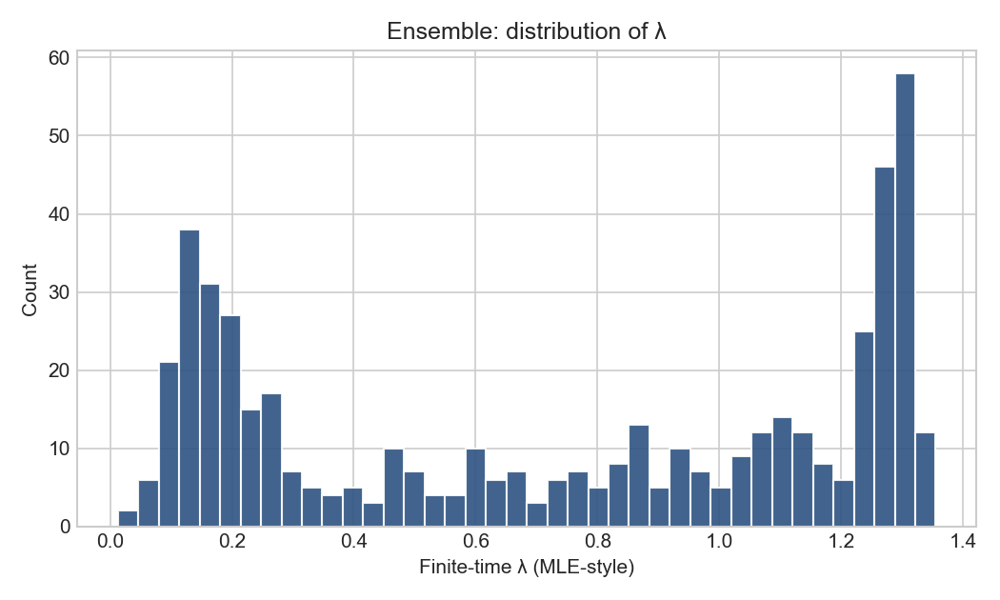
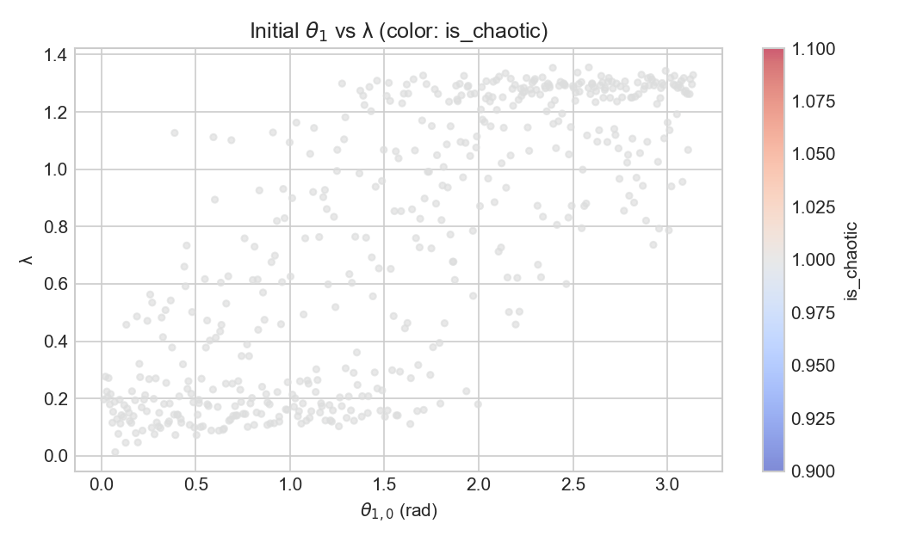
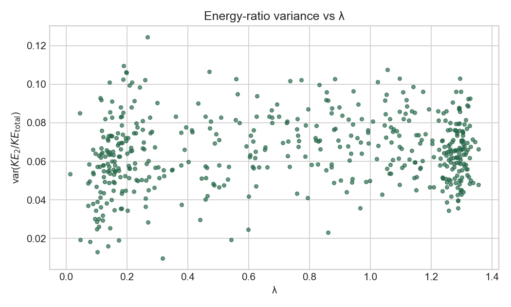
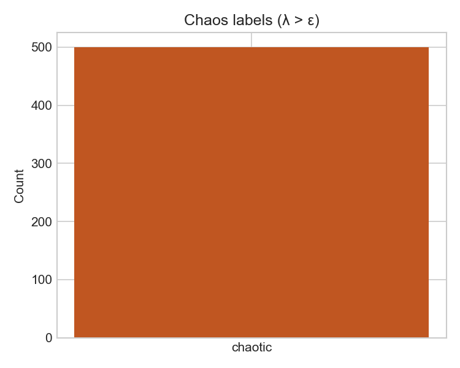

# Validation report — 31 March 2026

## Scope

This report documents:

1. **Automated test suite** (`pytest tests/`)
2. **Full ensemble + statistics pipeline** (`main.py`) with **`n_pendulums = 500`**, LHS **`seed = 42`**, default `config.yaml` parameter boxes
3. **Code fixes** uncovered during validation (energy drift metric; single-class logistic)

**Compute note:** Integration uses **SciPy `solve_ivp` (RK45)** and **joblib** parallelism (`n_jobs: -1`). **No GPU** is involved in this stack.

---

## 1. Automated tests

| Command | Result |
|---------|--------|
| `python3 -m pytest tests/ -v` | **8 passed** |

| Module | Tests |
|--------|-------|
| `tests/test_physics.py` | Energy conservation (scaled drift), small-angle period, chaotic MLE / separation |
| `tests/test_ensemble.py` | LHS span coverage, parallel reproducibility (same seed) |
| `tests/test_stats.py` | GPR synthetic relation, logistic monotonicity, inverse consistency |

---

## 2. Full pipeline ensemble run

| Step | Command | Outcome |
|------|---------|---------|
| Re-simulate ensemble | `python3 main.py --force --n 500` | **Completed** — 500 parallel members, wall time **~275 s** (integrator-dominated; exact time depends on core count) |
| Statistics + figures + report (reuse Parquet) | `python3 main.py` | **Completed** — ~**252 s** wall time (GPR + bootstrap dominates) |

Outputs (default locations):

- `data/results/ensemble_results.parquet`
- `data/results/ensemble_checkpoint.parquet`
- `data/results/*.png` (figures)
- `data/results/summary_report.txt`

---

## 3. Ensemble results summary (`n = 500`)

Loaded from `ensemble_results.parquet` after the run:

| Metric | Value |
|--------|--------|
| Rows | **500** |
| Missing values | **None** |
| `is_chaotic` true | **500 / 500 (100%)** |
| `mle` min / median / max | **~0.013 / ~0.81 / ~1.36** |
| `theta1` range (rad) | **~0.013 – 3.14** (spans configured box) |
| `energy_ratio_variance` min / median / max | **~0.010 / 0.065 / 0.12** |

### Interpretation: all runs labeled “chaotic”

With **`lyapunov.epsilon: 0`**, the rule is **chaotic iff λ > ε**, i.e. **any positive finite-time λ** is classified chaotic. In this ensemble, **every** run had **λ > 0**, so **`is_chaotic` is identically true**.

**Consequence:** **Logistic regression** on `is_chaotic ~ theta1` is **degenerate** (one class). The pipeline now returns a **constant** \(P(\mathrm{chaotic}\mid\theta_{1,0}) \equiv 1\) and a **threshold** at the **lower** \(\theta_1\) bound (consistent with “already above target probability everywhere”). This is **expected behavior** for the chosen definition and ranges, not an integration failure.

**If you need two classes** for a nontrivial logistic curve: increase **`epsilon`**, narrow initial-condition ranges toward milder motion, or extend the horizon / labeling definition — see project README **Limitations and scope**.

---

## 4. Issues found and fixes applied

### 4.1 Energy conservation check (ill-conditioned relative drift)

**Symptom:** Rare LHS samples failed `compute_energy_timeseries` with large “relative” drift when **`|E(0)|` was very small** — absolute error was tiny, but **dividing by `|E(0)|`** inflated the ratio.

**Fix:** Introduce **`scaled_max_energy_drift`**: scale drift by **`max(|E(0)|, 0.01 × E_char)`** where **`E_char = m₁gL₁ + m₂g(L₁+L₂)`** (gravitational energy scale). Tests updated to use the same metric.

**Files:** `src/physics/energy.py`, `tests/test_physics.py`

### 4.2 Logistic regression with one class

**Symptom:** `main.py` crashed in `find_chaos_threshold` with `ValueError: ... only one class`.

**Fix:** If `np.unique(y).size < 2`, return **degenerate** threshold info (constant probability grid, `logistic_model: None`), matching the previous Manim export fallback.

**Files:** `src/stats/threshold.py`, `src/output/visualize.py`, simplified `src/output/manim_export.py`

---

## 5. Figures in `figures/`

Generated by [`generate_validation_figures.py`](generate_validation_figures.py):

| File | Content |
|------|---------|
| `mle_histogram.png` | Distribution of finite-time λ |
| `theta1_vs_mle.png` | Scatter: initial θ₁ vs λ |
| `energy_variance_vs_mle.png` | Energy-ratio variance vs λ |
| `chaos_label_bar.png` | Count of chaotic vs not (this run: single bar) |

### Visual summary (this validation run)

---

## 6. Reproducibility checklist

- [ ] `cd double_pendulum_sim`
- [ ] `python3 -m venv .venv && source .venv/bin/activate`
- [ ] `pip install -r requirements.txt`
- [ ] `python3 -m pytest tests/ -v`
- [ ] `python3 main.py --force --n 500`
- [ ] `python3 main.py` (optional second pass if Parquet already exists)
- [ ] `python3 "Validation Test Reports/generate_validation_figures.py"`

---

*Generated as part of the validation documentation pass; commit on repository `main` with message describing Validation Test Reports and validation fixes.*
